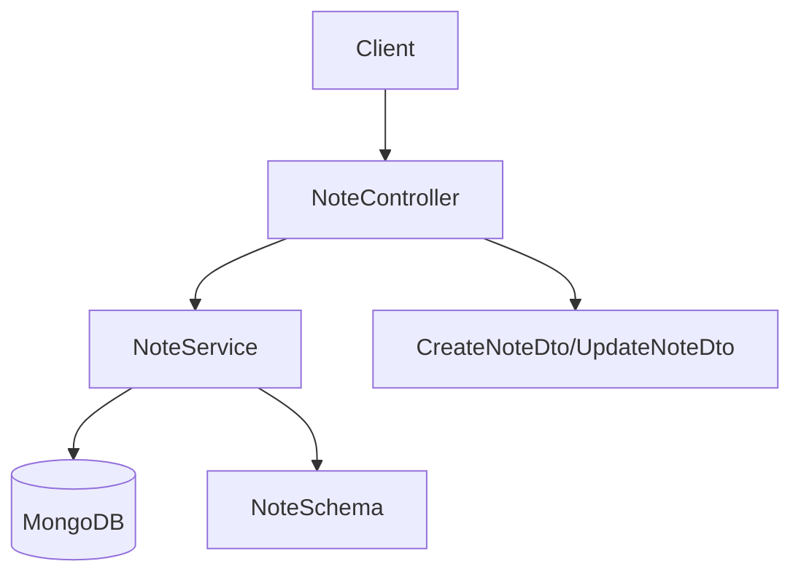

# Note Module Architecture

## Overview
The note module is a NestJS module that provides CRUD (Create, Read, Update, Delete) operations for user notes. It follows a standard NestJS architecture with controllers, services, DTOs, interfaces, and schemas.

## Architecture Diagram



## Components

### 1. Note Controller (`note.controller.ts`)
Handles HTTP requests and routes for note operations:
- `POST /notes/create` - Create a new note
- `GET /notes/all` - Get all notes for a user
- `GET /notes/:id` - Get a specific note by ID
- `PATCH /notes/update/:id` - Update a note
- `DELETE /notes/remove/:id` - Delete a note

All endpoints require a user ID in the `x-user-id` header for authentication.

### 2. Note Service (`note.service.ts`)
Contains the business logic for note operations:
- Creating new notes
- Finding notes by user ID
- Finding specific notes by ID
- Updating notes
- Deleting notes

### 3. DTOs (`note.dto.ts`)
Data Transfer Objects for validation and API documentation:
- `CreateNoteDto` - For creating new notes (title required, content optional)
- `UpdateNoteDto` - For updating existing notes (both title and content optional)

### 4. Interface (`note.interface.ts`)
Defines the structure of a note document:
- `id` - Note identifier
- `title` - Note title
- `content` - Note content
- `createdAt` - Creation timestamp
- `updatedAt` - Last update timestamp
- `authorId` - User identifier of the note author

### 5. Schema (`note.schema.ts`)
Defines the Mongoose schema for the Note model:
- `title` - Required string
- `content` - Required string
- `authorId` - Required string (user identifier)

## Issues and Improvements

### Issues Found

1. **Inconsistency in Interface and Schema**:
   - The interface uses `authorId` while the service methods use `userId`
   - The interface defines `id` but Mongoose documents use `_id`

2. **Missing Validation**:
   - No validation for `authorId` format (should be a valid MongoDB ObjectId)
   - No validation for note content length

3. **Naming Inconsistency**:
   - The interface is named `note` but should be `Note` (PascalCase)
   - The interface property `authorId` doesn't match the service parameter `userId`

### Recommendations

1. **Fix Interface and Schema Consistency**:
   ```typescript
   export interface Note extends Document {
     title: string;
     content: string;
     createdAt: Date;
     updatedAt: Date;
     userId: string; // Changed from authorId to match service
   }
   ```

2. **Add Proper Validation**:
   - Add validation for `authorId` format
   - Add content length validation in DTOs

3. **Improve Error Handling**:
   - Add more specific error messages
   - Consider adding a custom exception filter for note-related errors

4. **Enhance Documentation**:
   - Add more detailed comments to methods
   - Add examples for API endpoints

5. **Security Considerations**:
   - Implement proper authentication middleware instead of relying on headers
   - Add rate limiting for note operations